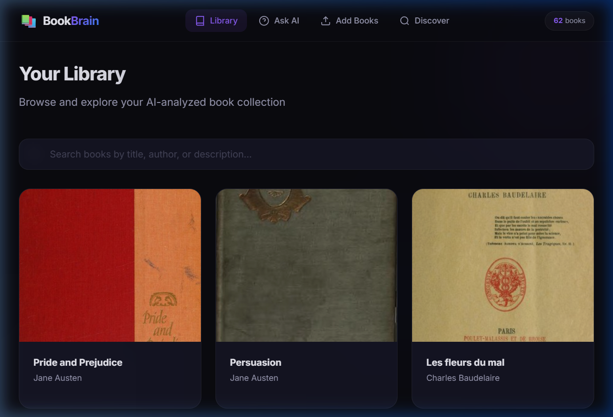
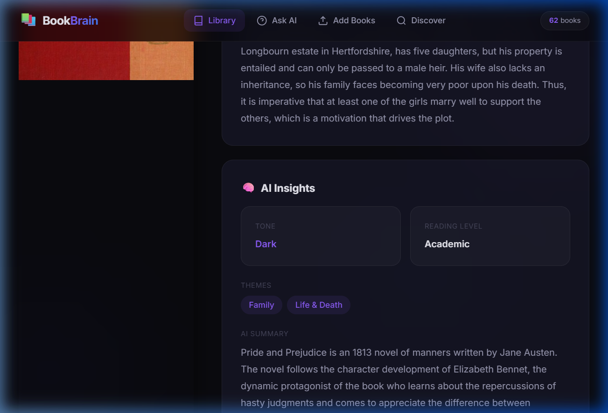
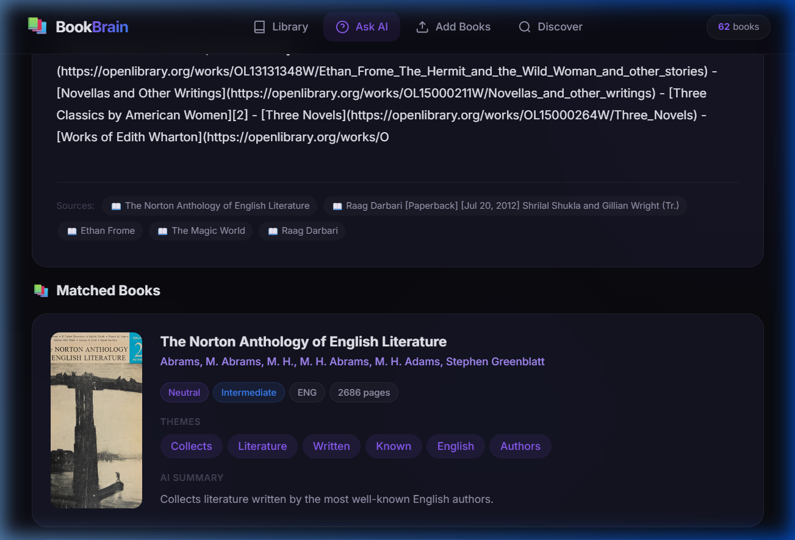
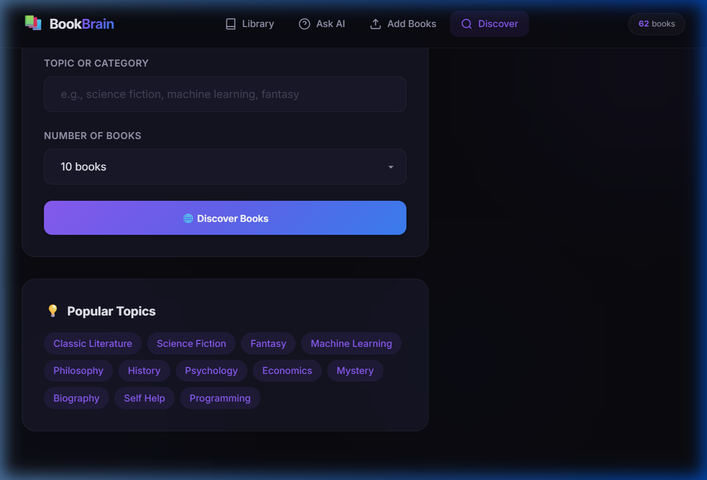

# 📚 BookBrain — AI-Powered Book Intelligence Platform

A full-stack web application that automates book data collection, manages it via a Django REST Framework backend, and provides AI-driven querying, summaries, and recommendations — all running locally without external API keys.


---

## 🖼️ Screenshots

### 1. Library View
Browse all books with cover art, author info, ratings, and category tags in a responsive card grid.



### 2. Book Detail Page
Full book information with AI-generated insights including themes, sentiment analysis, reading level, and AI summary.



### 3. AI Q&A Interface
Ask natural language questions with structured answers showing matched books, summaries, genres, themes, and personalized recommendations.



### 4. Discover Books
Scrape and import books by topic from Open Library and Google Books public APIs.



---

## 🚀 Setup Instructions

### Prerequisites
- Python 3.10 or higher
- pip (Python package manager)

### Step 1: Clone the Repository

```bash
git clone https://github.com/vaibhav12-34/bookbrain.git
cd bookbrain
```

### Step 2: Install Dependencies

```bash
cd backend
pip install -r requirements.txt
```

### Step 3: Set Up the Database

```bash
python manage.py migrate
```

### Step 4: Start the Backend Server

```bash
python manage.py runserver 0.0.0.0:8000
```

### Step 5: Start the Frontend Server (open a second terminal)

```bash
cd frontend
python -m http.server 3000
```

### Step 6: Open in Browser

Go to **http://localhost:3000**

### Step 7: Add Books

- Click **"Discover"** → enter a topic (e.g., "Hindi Literature") → click **"Discover Books"**
- Or click **"Add Books"** → enter a title like "Godan" → click **"Search & Add Book"**

---

## 📡 API Documentation

Base URL: `http://localhost:8000/api/`

### GET Endpoints

| Endpoint | Description | Example |
|----------|-------------|---------|
| `GET /api/books/` | List all books (paginated, searchable) | `/api/books/?search=Premchand` |
| `GET /api/books/<id>/` | Get full book detail with AI insights | `/api/books/1/` |
| `GET /api/books/<id>/recommendations/` | Get AI-powered book recommendations | `/api/books/1/recommendations/` |
| `GET /api/authors/` | List all authors | `/api/authors/` |
| `GET /api/categories/` | List all categories | `/api/categories/` |
| `GET /api/stats/` | Get database statistics | `/api/stats/` |

### POST Endpoints

#### Upload a Book
```
POST /api/books/upload/
Content-Type: application/json

{
    "query": "The Great Gatsby",
    "search_type": "title"    // "title" or "isbn"
}
```

#### Bulk Scrape by Topic
```
POST /api/books/scrape/
Content-Type: application/json

{
    "topic": "science fiction",
    "max_results": 10
}
```

#### Ask a Question (RAG)
```
POST /api/books/ask/
Content-Type: application/json

{
    "question": "Tell me about Godan by Premchand"
}
```

**Response includes:** `answer`, `sources`, `confidence`, `matched_books` (with summaries, genres, themes), and `recommendations`.

---

## 💬 Sample Questions & Answers

### Q1: "Tell me about Godan by Premchand"
**Answer:** *"Godan," a cornerstone of Hindi literature, is a powerful novel by Munshi Premchand that delves deep into the socio-economic realities of rural India in the early 20th century. It tells the story of Hori, a poor peasant, and his unwavering desire to own a cow, a symbol of prosperity in the village...*
- **Confidence:** Medium (59%)
- **Themes:** Society & Class, Faith & Religion
- **Recommendations:** Nirmala, Devdas, Kamayani

### Q2: "Recommend books similar to Godan"
**Answer:** *Based on your interest, you might enjoy these books: 1. Kamayani (Hindi Edition) 2. An Encyclopaedia of World Hindi Literature 3. Godāna 4. (Khaiyaam Ki Madhushala (Hindi Edition) 5. Lahar Aur Kamayani*
- **Confidence:** Medium (59%)

### Q3: "What books do you have in the library?"
**Answer:** Returns a list of all books with their descriptions, matched book cards showing cover art, AI summaries, and genre tags.
- **Matched Books:** Displayed with cover images, themes, sentiment, and reading level

### Q4: "Summarize the most popular book"
**Answer:** Returns an AI-generated summary of the highest-rated book with themes such as "Life & Death", "Adventure", and "Freedom & Justice", along with related book recommendations.

### Q5: "What genres are available?"
**Answer:** Lists available genres including Fiction, Hindi Poetry, Biography & Autobiography, Literary Criticism, and more from across the library.

---

## 🤖 AI Features (No API Key Required)

All AI features run locally — no external API keys needed.

| Feature | Technology | Description |
|---------|-----------|-------------|
| **Embeddings** | `sentence-transformers/all-MiniLM-L6-v2` | Converts book text to vector embeddings |
| **Vector Store** | ChromaDB | Persistent local vector database for similarity search |
| **RAG Q&A** | Embedding similarity + extractive answering | Answer questions using book content |
| **Summaries** | Sentence scoring + extraction | Generate book summaries automatically |
| **Theme Detection** | Keyword frequency + theme mapping | Identify themes like "Society & Class" |
| **Sentiment Analysis** | Rule-based tone classification | Detect book tone (Romantic, Dark, etc.) |
| **Recommendations** | Cosine similarity + metadata overlap | Find similar books using AI |

> **Optional Enhancement:** Add a `GEMINI_API_KEY` to the `.env` file for enhanced AI answers using Google Gemini.

---

## 🏗️ Project Structure

```
bookbrain/
├── backend/
│   ├── bookbrain/          # Django project settings
│   │   ├── settings.py     # Configuration (DB, CORS, REST framework)
│   │   └── urls.py         # Root URL routing
│   ├── books/              # Main application
│   │   ├── models.py       # Book, Author, Category, BookChunk models
│   │   ├── views.py        # REST API endpoints
│   │   ├── serializers.py  # DRF serializers
│   │   ├── urls.py         # API URL routing
│   │   └── admin.py        # Django admin configuration
│   ├── scraper/            # Book data scraping engine
│   │   ├── engine.py       # Orchestrator - merges data from APIs
│   │   ├── open_library.py # Open Library API client
│   │   └── google_books.py # Google Books API client
│   ├── ai_engine/          # AI processing pipeline
│   │   ├── embeddings.py   # Sentence-transformers + ChromaDB
│   │   ├── insights.py     # Summary, themes, sentiment generation
│   │   ├── rag.py          # RAG question-answering engine
│   │   └── recommendations.py  # Content-based recommendation engine
│   ├── manage.py
│   └── requirements.txt    # Python dependencies
├── frontend/
│   ├── index.html          # SPA shell with navigation
│   ├── css/styles.css      # Premium dark theme with glassmorphism
│   └── js/app.js           # SPA router, API client, page renderers
├── screenshots/            # UI screenshots for documentation
├── samples.json            # Sample API requests for testing
├── .env                    # Environment config (optional Gemini key)
├── .gitignore
└── README.md
```

---

## 🛠️ Tech Stack

| Layer | Technology |
|-------|-----------|
| **Backend** | Python, Django 5.x, Django REST Framework |
| **AI/ML** | sentence-transformers, ChromaDB |
| **Frontend** | Vanilla HTML, CSS (dark glassmorphism theme), JavaScript (SPA) |
| **Data Sources** | Open Library API, Google Books API |
| **Database** | SQLite (development) |

---

## 📦 Dependencies

All dependencies are listed in `backend/requirements.txt`:

```
django>=5.0
djangorestframework>=3.15
django-cors-headers>=4.3
python-dotenv>=1.0
requests>=2.31
chromadb>=0.4
sentence-transformers>=2.2
```

Install with: `pip install -r backend/requirements.txt`

---

## 📄 License

MIT License — feel free to use and modify.
